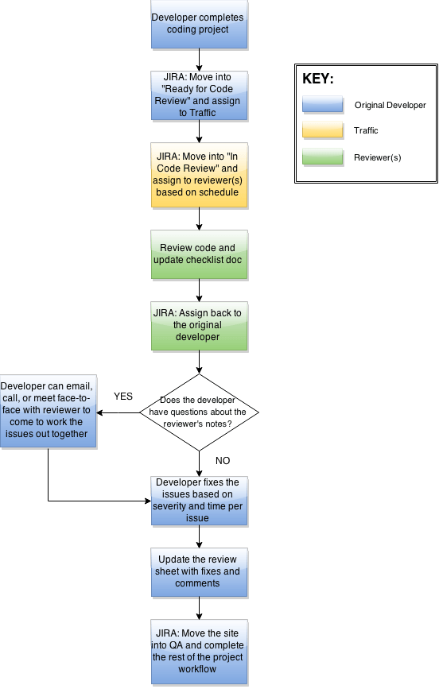

Last Updated: **{{ "now" | date: "%A, %B %-d, %Y" }}**

<section id="code-review" markdown="block">

## 1. Overview

Code reviews can be defined as the systematic review of code by peers which reduces defects, spreads code ownership, and mentors developers both experienced and new to the team. They must not be rigid or rigorous so that they encourage and make the team feel free to discuss best coding practices.

[Return to Table of Contents](#table-of-contents){: .back-to-toc }

## 2. Hurdles of Adoption

*"It takes too much time"*  
This is incorrect as defects are rejected before the client can find them. Fixing issues before they are discovered later on will significantly decrease maintenance time. It also ensures all code follows a certain standard, so when another developer other than the original author needs to perform maintenance on a site, they will be familiar with the coding style thus decreasing the time required to fix the issue. Lastly, every developer involved in the process will have learned something from each review, which will build an aggregate of skills that will be applied to each new project.

*"Code reviews can get nasty"*  
Defects found should be celebrated since it is a learning experience and proof that the team process is working correctly. Also by following a standardized code review process, issues can be backed up by documentation when necessary. Reviews should not be viewed as neither right or wrong. They should encourage discussion among peers about what is considered best practice, potentially leading to a change to the code standards.

*"We need to stick to an XYZ process"*  
Code reviews are typically non-conforming. Depending on the level of detail the reviews are assessed, they can be molded to fit whatever current processes are already in place. For example, more detailed reviews could be implemented early on to bring the entire team to a more even level of style, correctness, and altruism. As the team starts to get on the same page, review times and detail can decrease.

[Return to Table of Contents](#table-of-contents){: .back-to-toc }

## 3. Code Review Process

When the developer has finished coding the project and it is ready to be reviewed by QA, it must first be sent to another developer for a code review. At this time, the developer should contact traffic in order to schedule a peer review by another developer who is currently available based on their schedule. Two hours will be needed for each review, one for reviewing the code and documenting the issues and another for the one-on-one preparation and meeting to discuss the issues.

Reviewers will be provided a spreadsheet that contains a list of items from the standards that they should use as a checklist when reviewing the code. Reviewers do not need to go through every line of code and find every issue. Instead, they should look for instances of each item on the checklist, identify the issue, provide an explanation of the issue, provide an example of the issue in either the form of a screenshot, in text, or both. They should then provide the section where the issue is stated in the code standards and/or provide a solution if possible. Other issues outside the standards can be addressed, but they must be major issues that either cause or can cause the site to break during maintenance. These issues will need a detailed explanation or external reference stating why it needs to be done differently.

After reviewing the code, the issue list created by the reviewer will be sent to the original developer. If it is required, the two can set a meeting to discuss the issues found either face-to-face or over the phone. Major issues flagged need to be fixed by the original developer if they can potentially lead to problems in the site. Other issues are up to the developer to decide based upon the time and weight of the issues. After completion, the issues document should then be sent to the standards mod in order to store and evaluate potential changes to the standards based on the findings. At this point the review process is complete and the developer should move the project into QA where it will continue on with the normal lifecycle.

[Return to Table of Contents](#table-of-contents){: .back-to-toc }

## 4. Code Review Workflow

</section>
